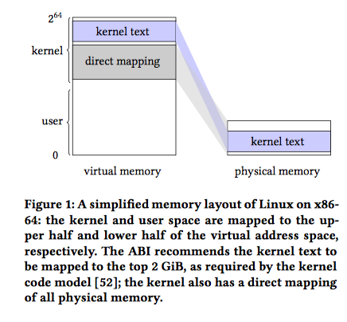
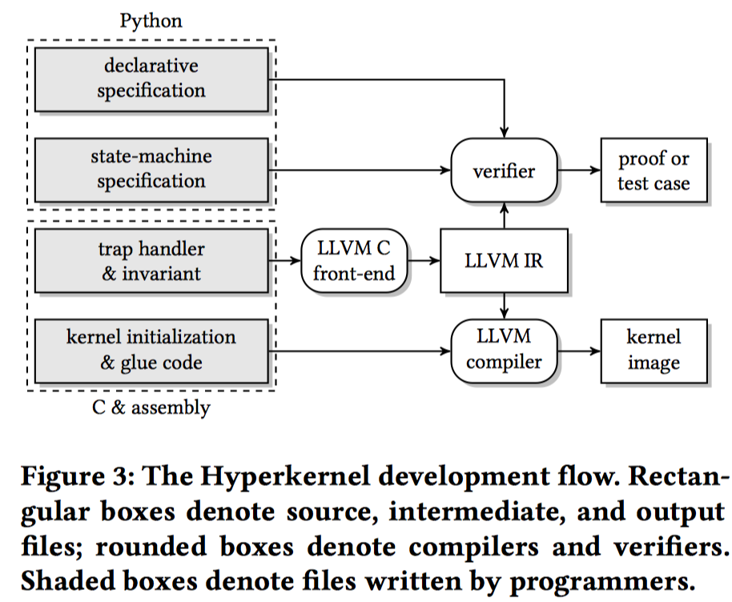

# Hyperkernel: Push-Button Verification of an OS Kernel

## 简介

本文描述了一种设计、实现和正式验证操作系统内核功能正确性的方法（Hyperkernel），它具有高度的验证自动化和低验证负担。

Hyperkernel的界面设计在xv6上，一个类unix操作系统。

Hyperkernel引入了三个关键思想来实现证明自动化：

1. 它限定了内核接口以避免无限循环或递归
2. 它分离内核和用户地址空间以简化关于虚拟内存的推理
3. 它在LLVM中间表示级别执行验证以避免建模的复杂C语义

Hyperkernel使用Z3 SMT解算器来验证Hyperkernel的实施。实验过程中共检查了50个系统调用和相关陷阱处理，其可以避免类似在xv6中发现的错误，并且这种检测的消耗不大

## 主要内容

##### 主要贡献

- 构建了经过验证的操作系统内核的按钮式方法
- 构建了适用于SMT解决方案的内核接口设计

##### 主要研究挑战

- 界面设计，它需要在可用性和校验自动化之间取得平衡。一方面，内核维护着一套丰富的数据结构和不变式来管理进程，虚拟内存和设备等资源。另一方面，系统提供的接口必须以一种能够用SMT解算器完全自动验证这些属性的方式来实现

- 内核代码中的虚拟内存管理。两个虚拟地址可能映射到同一个物理地址。因此，关于内核数据结构的推理需要关于虚拟到物理映射的推理。这种推理任务由于内核代码可以在执行过程中改变虚拟物理映射的事实而变得更加复杂。如下图所示：

  

- Hyperkernel也是一个以C语言编写的系统，而C语言是一种已知形式推理复杂化的编程语言。

##### Hyperkernel的解决方案

- 内核接口被设计为有限的：系统调用、异常和中断的所有处理程序都没有无线循环和递归。从而保证可以对他们编程和验证的时候使用SMT

- Hyperkernel使用用户空间的独立空间运行，使用内核的身份映射，这样简化了内核代码的推理。
  - 为了有效地实现这种分离，Hyperkernel使用Intel VTx和AMD-V提供的x86虚拟化支持：内核和用户进程分别使用单独的页表在根（主机）和非根（guest）模式下运行

- Hyperkernel在LLVM中间表示（IR）级别执行验证，语义比C更简单，同时保持足够高的级别以避免关于机器细节的推理。

  架构图如下：

  

##### 其他

- 性能方面使用Z3 SMT解算器，在8核机器上约15分钟内完成验证

- 整个设计过程中，作者主要依赖两种规范来描述系统调用的正确性
  - 功能正确性：详细的状态及规范
  - 手工检查：高层次的声明式规范
- 选择LLVM的原因
  - 相比于C代码，LLVM的语义简单，而且未定义的行为更少。
  - 与汇编相比，LLVM保留高层的信息，比如类型，但是同时又不涉及过多的细节。

## 参考

1. [https://locore.cs.washington.edu/papers/nelson-hyperkernel.pdf](https://locore.cs.washington.edu/papers/nelson-hyperkernel.pdf)
2. [https://zhuanlan.zhihu.com/p/30105945](https://zhuanlan.zhihu.com/p/30105945)
3. [https://locore.cs.washington.edu/papers/nelson-hyperkernel-poster.pdf](https://locore.cs.washington.edu/papers/nelson-hyperkernel-poster.pdf)
4. 